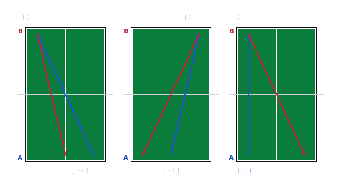

# 🏓 Tischtennis-Übungsdesign-Visualisierer

> Übungen aus einfacher Textnotation als saubere Tisch-Grafik zeichnen — und als PNG oder SVG exportieren.

**[▶️ Live-Demo](https://flocksserver.github.io/tt-exercises-vis/)** · 🇩🇪 Deutsch · [🇬🇧 English](README.md) · MIT-Lizenz



Trainer:innen und Spieler:innen notieren Übungen in einer knappen Kurzform wie
`VHT aus VH in Mitte`. Dieses Tool liest die Kurzform und zeichnet sie — ein kleiner Tisch pro
Ballwechsel-Schritt, mit farbigen Ballweg-Pfeilen für beide Spieler. Übung tippen, sofort sehen,
für den Trainingsplan exportieren.

Kein Account, keine Installation, kein Build — eine einzige statische Seite, komplett im Browser.

## Highlights

- **Text → Grafik, live.** Notation tippen, die Tisch-Ansicht aktualisiert sich sofort.
- **Zwei Eingabearten.** Eine **Tabelle** (ein Ballwechsel-Schritt je Zeile) oder eine freie
  **Sequenz** — die Schläge von Spieler A tippen (eine je Zeile, oder mit `->` / Komma getrennt),
  Spieler B wird automatisch ergänzt.
- **Spracheingabe (on‑device).** Spieler-A-Sequenz per Mikrofon diktieren — die Erkennung läuft
  **lokal im Browser** (Whisper via WASM/WebGPU), keine Cloud, kein API-Key. Optional; das Modell
  lädt beim ersten Klick und funktioniert danach offline.
- **Versteht echte Coaching-Kurzform.** Das `aus …` (Ursprung) darf entfallen — der Ursprung wird
  aus der **Ballverlauf-Kette** (letzter Landepunkt) bzw. der Schlaghand abgeleitet.
- **Reiche Notation:** Richtungen (`diagonal` / `parallel`), Tiefen (`kurz` / `halblang` / `lang`),
  Zonen (`ganzer Tisch`, `halber Tisch RH`, `Mitte VH`), Wiederholungen (`2-3 mal`) und
  **Alternativen** mit `oder` — bei Technik, Ursprung, Ziel, Richtung oder ganzen Schlägen.
- **Tippfehler-tolerant.** Vertippt bei Position, Keyword oder Richtung? Die Fehlermeldung nennt
  den nächsten gültigen Begriff – *„meinten Sie ‚Mitte‘?"* (nur Vorschlag, keine stille Korrektur).
- **Schlaue Pfeile.** Spielen beide dieselbe Linie, verschmelzen die Pfeile zu einer Linie mit
  zwei Spitzen und Farbverlauf, der am Netz wechselt.
- **Balleimer-Modus** (Multiball) für Beinarbeits-Übungen mit Zuspiel.
- **Export** als **PNG** oder **SVG**.
- **Zweisprachig** (Deutsch / Englisch) per Flaggen-Umschalter — Standard = Browsersprache.
- **Keine Abhängigkeiten, kein Build.** Reines HTML/CSS/Vanilla-JS, durch 100+ Tests abgesichert.

## Notation

Pro Tabellenzeile ein Ballwechsel-Schritt. **Spieler A** steht vorne, **Spieler B** hinten.

```
[N mal] TECHNIK [Richtung] [aus [Tiefe] POSITION] in [Tiefe] ZIEL
Frei | endlos

Richtung = diagonal | parallel
Tiefe    = kurz | halblang | lang
POSITION = VH | RH | weite/tiefe VH/RH | Mitte | Mitte VH/RH | ganzer Tisch | halber Tisch VH/RH
ZIEL     = POSITION [oder [Tiefe] POSITION] …   |   POSITION bis POSITION
```

- **TECHNIK** — ein Wort (z. B. `VHT`, `RHB`, `Schupf`, `Block`, `Aufschlag`); Varianten mit `/`.
- **`aus …` ist optional** — weglassen (`VHT in RH`), der Ursprung kommt aus dem Ballverlauf.
- **Ziel & Richtung sind ebenfalls optional** — ein bloßes `VHT` gilt als **diagonal aus der Schlaghand** (also `VHT` ≡ `VHT aus VH diagonal`); der Ursprung folgt weiter dem Ballverlauf, wenn bekannt.
- **Bruchzonen** — `Block in 2/3 VH`, `¾ VH-Tisch`: schattiertes Band über den Bruchteil zur Seite hin.
- **`Frei`** beendet die Rally, **`endlos`** = Dauerübung.
- Viele Kurzformen und Synonyme werden ebenfalls erkannt.

### Beispiele

| Eingabe | Bedeutung |
| --- | --- |
| `VHT aus VH in Mitte` | Vorhand-Topspin aus der Vorhand in die Mitte |
| `RHK/RHT in RH` | Rückhand-Konter **oder** -Topspin in die RH (Ursprung aus dem Ballverlauf) |
| `VHT aus VH diagonal` | Vorhand-Topspin diagonal (Ziel wird abgeleitet) |
| `VHT aus VH diagonal oder parallel` | … diagonal **oder** längs (beides gezeigt) |
| `kurzer Aufschlag in kurze RH` | Kurzer Aufschlag, der kurz in die RH gelegt wird |
| `VHT in VH bis Mitte` | Zielzone zwischen Vorhand und Mitte |
| `2-3 mal RHK in RH` | Schritt 2- bis 3-mal wiederholen |
| `VHT aus VH in RH oder RHT aus RH in RH` | Spieler A spielt einen von zwei kompletten Schlägen |

## Grafik-Legende

- Blauer Pfeil = **Spieler A**, roter Pfeil = **Spieler B**, grau gestrichelt = **Zuspiel** (Balleimer).
- Gleiche Strecke hin & zurück = **eine Linie, zwei Spitzen**; Farbwechsel am Netz.
- Gestrichelt = Alternative (`oder`) bzw. Zuspiel.
- Schattierte Fläche = Bereich (`bis`), `ganzer Tisch` oder `unregelmäßig`.
- Tiefe am Tisch: Netz = kurz, Mitte = halblang, Grundlinie = lang.

## Lokal starten

Statische Seite — über einen lokalen Webserver öffnen (die Module laden per HTTP):

```bash
cd src
python3 -m http.server 8000
# http://localhost:8000
```

## Tests

Abhängigkeitsfreie Unit-Tests mit Node (winziges DOM-Stub für den Renderer):

```bash
npm test          # oder: node --test tests/*.test.js
```

Abgedeckt: Notation-Parser, Geometrie, Resolver (Ballverlauf-Kette), Renderer und i18n.

## Projektstruktur

```
src/
├── index.html          One-Pager (Werkzeug + Legende)
├── css/style.css
└── js/
    ├── i18n.js         Zweisprachigkeit DE/EN
    ├── notation.js     Parser & Validator (Grammatik + Synonyme im LEXICON)
    ├── geometry.js     Tisch- und Positions-Koordinaten (Tiefen + Zonen)
    ├── resolver.js     Ballverlauf-Kette + Richtungs-Ableitung
    ├── renderer.js     SVG-Zeichnung (Tisch, Pfeile, Zonen, Balleimer, Labels)
    ├── export.js       PNG-/SVG-Export
    └── app.js          UI, Live-Validierung, Auto-Render
tests/                  Node-Testsuite
```

## Unterstützen

Wenn dir das Tool hilft, kannst du die Weiterentwicklung unterstützen:

<a href="https://www.buymeacoffee.com/flocksservK"></a>

## Entstehung

Mit viel Liebe zum Sport und KI gebaut. 🏓🤖

## Lizenz

[MIT](LICENSE) — frei für jeden Zweck (privat und kommerziell). Von Marcel Kaufmann.
Ursprünglich ein Homepage-Experiment von 2015, von Grund auf neu gebaut.
