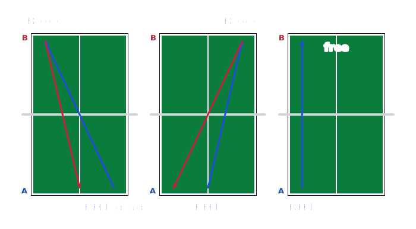

# 🏓 Table Tennis Drill Designer

> Turn plain text notation into clean table‑tennis drill diagrams — and export them as PNG or SVG.

**[▶️ Live demo](https://flocksserver.github.io/tt-exercises-vis/)** · 🇬🇧 English · [🇩🇪 Deutsch](README.de.md) · MIT licensed



Coaches and players jot drills in a compact shorthand like `FHT from FH to middle`
("forehand topspin from the forehand into the middle"). This tool reads that shorthand and
draws it — one mini table‑tennis table per rally step, with coloured ball‑path arrows for
both players. Type a drill, watch it appear, export it for your training plan.

No accounts, no install, no build step — a single static page that runs entirely in your browser.

## Highlights

- **Text → diagram, live.** Type the notation, the table view updates instantly.
- **Two input modes.** A **table** (one rally step per row) or a free **sequence** — type Player A’s
  strokes (one per line, or separated by `->` / comma) and Player B is filled in automatically.
- **Voice input (on‑device).** Dictate Player A’s sequence with the microphone — speech recognition
  runs **locally in your browser** (Vosk via WebAssembly, constrained to the drill vocabulary), no
  cloud, no API key. Optional; the model loads on first use, then works offline.
- **Understands real coaching shorthand.** The `from …` (origin) may be omitted — the origin is
  inferred from the **rally chain** (where the previous ball landed) or the stroke’s hand.
- **Rich notation:** directions (`diagonal` / `parallel`), depths (`short` / `half-long` / `long`),
  zones (`whole table`, `half table BH`, `middle FH`), repetitions (`2-3 times`), and
  **alternatives** with `or` on the technique, origin, target, direction — or whole strokes.
- **Typo‑friendly.** Misspell a position, keyword or direction and the error points you at the
  closest valid word — *“did you mean ‘middle’?”* (a suggestion only, never a silent rewrite).
- **Smart arrows.** When both players hit the same line, the two arrows merge into a single
  two‑headed line with a colour gradient that switches at the net.
- **Ball‑feeder (multiball) mode** for one‑player footwork drills (in both input modes).
- **Export** the diagram as **PNG** or **SVG**.
- **Bilingual UI** (German / English) with a flag switch — defaults to your browser language.
- **Zero dependencies, no build.** Plain HTML/CSS/vanilla JS. Covered by 100+ unit tests.

## Notation

One table row per rally step. **Player A** is at the front, **Player B** at the back.

```
[N times] TECHNIQUE [direction] [from [depth] POSITION] to [depth] TARGET
free | endless

direction = diagonal | parallel
depth     = short | half-long | long
POSITION  = FH | BH | wide FH/BH | middle | middle FH/BH | whole table | half table FH/BH
TARGET    = POSITION [or [depth] POSITION] …   |   POSITION through POSITION
```

- **TECHNIQUE** — one word (e.g. `FHT`, `BHB`, `push`, `block`, `serve`); variants with `/`.
- **`from …` is optional** — leave it out (`FHT to BH`) and the origin comes from the ball path.
- **Target & direction are optional too** — a bare `FHT` defaults to **diagonal from the playing hand** (so `FHT` ≡ `FHT from FH diagonal`); the origin still follows the ball path when it's known.
- **Fraction zones** — `block to 2/3 FH`, `¾ FH table`: a shaded band covering that fraction of the table toward the side.
- **`free`** ends the rally, **`endless`** marks a continuous drill.
- **Bilingual notation.** The parser accepts English **and** German keywords interchangeably —
  `FH/BH` or `VH/RH`, `from/aus`, `to/in`, `or/oder`, `through/bis`, `times/mal`, `whole table /
  ganzer Tisch`, … Switch the UI language with the flags; the examples follow.

### Examples

| Input | Meaning |
| --- | --- |
| `FHT from FH to middle` | Forehand topspin from the forehand into the middle |
| `BHC/BHT to BH` | Backhand counter **or** topspin into the backhand (origin from the rally) |
| `FHT from FH diagonal` | Forehand topspin cross‑court (target derived from the direction) |
| `FHT from FH diagonal or parallel` | … cross‑court **or** down the line (both shown) |
| `short serve to short BH` | Short serve landing short in the backhand |
| `FHT to FH through middle` | Target zone between forehand and middle |
| `2-3 times BHC in BH` | Repeat the step 2–3 times |
| `FHT from FH to BH or BHT from BH to BH` | Player A plays one of two complete strokes |

## Diagram legend

- Blue arrow = **Player A**, red arrow = **Player B**, grey dashed = **feed** (multiball).
- Same line there & back = **one line with two heads**; colour switches at the net.
- Dashed = an alternative (`or`) or a feed.
- Shaded area = a range (`through`), `whole table`, or `irregular` (variable placement).
- Depth on the table: near the net = short, middle = half‑long, baseline = long.

## Run locally

It's a static site — open it through any web server (needed because the modules load over HTTP):

```bash
cd src
python3 -m http.server 8000
# open http://localhost:8000
```

## Tests

Dependency‑free unit tests using Node's built‑in runner (a tiny DOM stub lets the renderer run
without a browser):

```bash
npm test          # or: node --test tests/*.test.js
```

They cover the notation parser, geometry, the rally resolver, the renderer (arrow merging,
dashing, zones, multiball) and the i18n layer.

## Project structure

```
src/
├── index.html          one-pager (tool + legend)
├── css/style.css
└── js/
    ├── i18n.js         German/English UI
    ├── notation.js     parser & validator (grammar + synonyms in one LEXICON)
    ├── geometry.js     table & position coordinates (depths + zones)
    ├── resolver.js     rally-chain origin + direction derivation -> drawable strokes
    ├── renderer.js     SVG drawing (tables, arrows, zones, multiball, labels)
    ├── export.js       PNG / SVG export
    └── app.js          UI, live validation, auto-render
tests/                  Node test suite
```

## Built with

Plain HTML, CSS and vanilla JavaScript — no framework, no bundler, no runtime dependencies.
The whole thing is a handful of small files served as static assets.

Built with a lot of love for the sport — and with AI. 🏓🤖

## Support

If this tool saves you time, you can support its development:

<a href="https://www.buymeacoffee.com/flocksservK"></a>

## License

[MIT](LICENSE) — free for any use, private or commercial. Created by Marcel Kaufmann.
Originally a 2015 homepage experiment, rebuilt from scratch.
